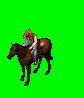

DVF
===

This type of file contains sprites and animation data.

File list
---------

* :file:`.\\Game\\Data\\Animations\\*`
* :file:`.\\Game\\Data\\Characters\\*`

Specifications
--------------

Structure
^^^^^^^^^

.. code-block:: text

    struct file_header
    for (file_header.nb_sprites) {
        struct sprite_header
        data   sprite
    }
    struct profiles_header
    for (profiles_header.nb_profiles) {
        struct profile
        for (profile.nb_animations * profile.nb_perspective) {
                struct animation
                for (animation.nb_frames) {
                    struct frame
                }
            }
        }
    }

File Header
^^^^^^^^^^^

.. code-block:: text

    + 0x00:    VERSION     [WORD]
    + 0x02:    NB_SPRITES  [WORD]      // number of sprites
    + 0x04:    PADDING     [WORD]      // NOT USED
    + 0x06:    MAX_WIDTH   [WORD]      // max width of all sprites
    + 0x08:    MAX_HEIGHT  [WORD]      // max height of all sprites
    + 0x0a:    PADDING     [BYTE] * 20 // NOT USED

* Size of ``Header`` : `0x1E`
* ``VERSION`` must be equal to 0x200

Sprite Header
^^^^^^^^^^^^^

.. code-block:: text

    + 0x00:    SIZE        [DWORD]  // offset to next sprite
    + 0x04:    WIDTH       [WORD]   // width of the sprite (pixel)
    + 0x06:    HEIGHT      [WORD]   // height of the sprite (pixel)
    + 0x08:    PADDING     [WORD]   // NOT USED
    + 0x0a:    SPRITE_DATA [BYTE] * SIZE

.. warning::

     The size of each row must be rounded up to a multiple of 4 bytes (a 32-bit DWORD) by padding

Sprite Data
^^^^^^^^^^^

For every row (height) in the sprite:

.. code-block:: text

    + 0x00:    NB_TRANSPARENT_PIXELS  [WORD]
    + 0x02:    NB_TOTAL_PIXELS        [WORD]

If ``NB_TOTAL_PIXELS`` (int16_t) is -1, the whole line is transparent (color for transparent is `0x7C0` or `0x1F`). If ``NB_TOTAL_PIXELS`` > -1, fill the first ``NB_TRANSPARENT_PIXELS`` pixels with transparent. Read 2 byte long pixels (R5G6B5) for ``NB_TOTAL_PIXELS`` times. Fill the remaining pixels (according to the sprite header's width) with transparent.

Profiles Header
^^^^^^^^^^^^^^^

.. code-block:: text

    + 0x00:    NB_PROFILES [WORD]   // number of profiles

Profile
^^^^^^^

.. code-block:: text

    + 0x00:    NAME              [BYTE] * 32  // profile name
    + 0x20:    NB_PERSPECTIVES   [WORD]       // number of perspectives the profile can be shown in
    + 0x22:    PADDING           [BYTE] * 32
    + 0x42:    NB_ANIMATIONS     [WORD]       // number of animations available for the profile
    + 0x44:    PADDING           [BYTE] * 16
    + 0x54:    MAX_WIDTH         [WORD]
    + 0x56:    MAX_HEIGHT        [WORD]
    + 0x58:    COORDINATE_X      [DWORD]
    + 0x5C:    COORDINATE_Y      [DWORD]
    + 0x60:    PADDING           [BYTE] * 20

* Size of ``Profile`` : `0x74`

Animation
^^^^^^^^^

.. code-block:: text

    + 0x00:    PADDING           [BYTE] * 4
    + 0x04:    NB_FRAMES         [WORD]
    + 0x06:    UNKNOWN0          [WORD]  // latest frame?
    + 0x08:    PADDING           [WORD]
    + 0x0a:    COORDINATE_X      [DWORD]
    + 0x0e:    COORDINATE_Y      [DWORD]
    + 0x12:    PERSPECTIVE_ID    [WORD]
    + 0x14:    ANIMATION_ID      [WORD]
    + 0x16:    ANIMATION_NAME    [BYTE] * 32

* Size of ``Animation`` : `0x36`

``UNKNOWN0``, ``COORDINATE_X``, ``COORDINATE_Y`` don't seem to have any impact.

.. warning::

    First byte of ``ANIMATION_NAME`` seems to always be `0x20` (``SPACE``) and can be ignored (old storage of the max length?).
    Please note that animations are referenced by their `ID` not their name.

Frame
^^^^^

.. code-block:: text

    + 0x00:    SPRITE_ID         [WORD]
    + 0x02:    DURATION          [WORD]
    + 0x04:    DISTANCE          [WORD]
    + 0x06:    COORDINATE_X      [WORD]
    + 0x08:    COORDINATE_Y      [WORD]
    + 0x0a:    SOUND_EFFECT      [WORD]
    + 0x0c:    PADDING           [WORD]

* Size of ``Frame`` : `0x0E`

``DURATION`` is the time until the next frame is shown. This seems to be a multiple of 1/30 seconds.

``DISTANCE`` is the distance the object covers while the animation displays the frame, 0 being the lowest distance, scaling upwards linear (might be a pixel unit or something arbitrary).

``COORDINATE_X`` and ``COORDINATE_Y`` is the relative position between the object and the frame. Different frames from one animation have different sizes so to keep the object in the frames centered the position must be adjusted by ``COORDINATE_X`` in X direction and ``COORDINATE_Y`` in Y direction.

When the frame is displayed and the ``SOUND_EFFECT`` contains a valid sound effect ID (id is not null), the sound effect will be played. The sound can be found in the folder ``data\\sounds\\fx_XXXX.wav``, where ``XXXX`` is the decimal value of ``SOUND_EFFECT``.

Example
-------

The file from the `demo` version ``demo\data\animations\level00_rodeo.dvf`` is used as an example.

* Extract all frames to BMP format in the output direcetory ``/tmp/bmp_out/``:

.. code-block:: console

    $ mkdir /tmp/bmp_out
    $ odv_files_test -t dvf -e -o /tmp/bmp_out/ /tmp/level00_rodeo.dvf
    [+] odv_dvf_open = /tmp/level00_rodeo.dvf
    $

* Display all extracted informations to the standard output:

.. code-block:: console

    $ odv_files_test -t dvf -i /tmp/bmp_out/ /tmp/level00_rodeo.dvf
    [+] odv_dvf_open = /tmp/level00_rodeo.dvf
        [Profile #0 information]
        + name            : L00 Rodeo
        + nb_perspectives : 0x0001
        + nb_animations   : 0x0003
        + max_width       : 0x006D (109)
        + max_height      : 0x0066 (102)
        + coordinate_x    : 0.000000
        + coordinate_y    : 0.000000
            [Animation #0 information]
            + nb_frames      : 0x0001
            [...]
            [Animation #2 information]
            + nb_frames      : 0x0024
            + unk_word_00    : 0x0023
            + unk_word_01    : 0x0000
            + coordinate_x   : 0.000000
            + coordinate_y   : 0.000000
            + perspective_id : 0x0000
            + animation_id   : 0x00A1
            + animation_name : Ejection
            [...]
                [Frame #14 information]
                + sprite_id    : 0x003C
                + duration     : 0x0001
                + distance     : 0x0000
                + coordinate_x : 86.000000
                + coordinate_y : 63.000000
                + sound_id     : 0x0599 (1433)
                + unused_00    : 0x0000
            [...]
    $

Extracted BMP file associated with the `profile 0 (L00 Rodeo)`, `animation 2 (Ejection)`, `Frame 14`:

.. figure:: ../images/L00\ Rodeo_Ejection_0014.bmp
    :align: center

    ``L00 Rodeo_Ejection_0014.bmp``

The sound file (``sound_id``) associated with this frame (`Frame 14` of `animation 2 (Ejection)`) is ``demo\data\sounds\fx_1433.wav``:

.. raw:: html

    <figure class="align-center">
    <audio controls="controls">
      <source src="../_static/fx_1433.mp3" type="audio/mp3">
      Your browser does not support the <code>audio</code> element. 
    </audio>
    </figure>

* Generate an animated GIF image for the `profile 0 (L00 Rodeo)`, `animation 1 (Rodeo 01)`:

.. code-block:: console

    $ convert -delay 1x60 -loop 0 'L00 Rodeo_Rodeo 01_*.bmp' Rodeo.gif

    ``Rodeo.gif``