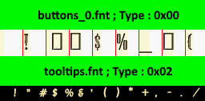

FNT
===

General
-------

Files with extension ``*.fnt`` contains a list of wide character 16-bit (2 bytes) with their 2D associated representation stored in embedded pictures (normal and bold type).

Specifications
--------------

.. code-block:: text

    struct fnt_header
    for fnt_header.nb_entry{
        struct char_entry
    }
    struct sbpicture
    struct sbpicture

FNT Header
----------

.. code-block:: text

    +0x00:    SIGNATURE     [BYTE] * 6
    +0x06:    VERSION       [DWORD]
    +0x0A:    FONT_NAME     [BYTE] * 36
    +0x2E:    TYPE          [DWORD]
    +0x32:    HEIGHT        [DWORD]
    +0x36:    UNK_DWORD_00  [DWORD]    // Width rectangle letter
    +0x3A:    UNK_DWORD_01  [DWORD]    // Maximum width letter
    +0x3E:    NB_ENTRY      [DWORD]
    if VERSION >= 0x200:
        +0x42:  UNK_DWORD_02  [DWORD]    // COORDINATE_Y + UNK_DWORD_05 ?
    end

* ``SIGNATURE`` must be equal to "SBFONT"
* ``TYPE``:
    * `0x00`: letter with a border between them
    * `0x02`: letter without a border between them

    Truncated extracted image extracted from ``buttons_0.fnt`` and ``tooltips.fnt``

Char Entry
----------

.. code-block:: text

    +0x00:    CHAR_VALUE     [WORD]
    +0x02:    COORDINATE_Y   [DWORD]
    +0x06:    WIDTH_LETTER   [DWORD]
    +0x0A:    PRE_SPACING    [DWORD]
    +0x0E:    POST_SPACING   [DWORD]

* The "real" witdh is computed: ``WIDTH_LETTER`` + ``PRE_SPACING`` + ``POST_SPACING``

SBPICTURE
---------

See :ref:`sbpicture`

Example (buttons_0.fnt and tooltips.fnt)
^^^^^^^^^^^^^^^^^^^^^^^^^^^^^^^^^^^^^^^^

.. code-block:: text

    [+] fnt_filename = .\buttons_0.fnt
    [+] first_unk_dword_00 = 0x00000200
    [+] name = PlugCapsSSK
    [+] unk_word_00 = 0000 (0)  // TYPE SOMETHING ?
    [+] unk_word_01 = 0000 (0)
    [+] unk_dword_02 = 00000021 (33)  // HEIGHT ?
    [+] unk_dword_03 = 0000001C (28)  // Width square letter
    [+] unk_dword_04 = 00000017 (23)  // Max width letter
    0000  74 00 00 00                                       t...
    [+] nb_entry = 0x00000074
    [+] unk_dword_05 = FFFFFFFD (4294967293)
    [+] num = 0000
    [+] char_value = 0x0020 (" ")
    [+] Y_COORD = 0x00000000
    [+] WIDTH_LETTER = 0x00000005
    [+] unk_dword_00 = 0x00000000
    [+] unk_dword_01 = 0x00000002
    [+] num = 0001
    [+] char_value = 0x0021 ("!")
    [+] Y_COORD = 0x0000001D
    [+] WIDTH_LETTER = 0x00000008
    [+] unk_dword_00 = 0x00000001
    [+] unk_dword_01 = 0x00000001
    
    --------------------
    
    [+] fnt_filename = .\tooltips.fnt
    [+] first_unk_dword_00 = 0x00000200
    [+] name = Lydian
    [+] unk_word_00 = 0002 (2)  // TYPE SOMETHING ?
    [+] unk_word_01 = 0000 (0)
    [+] unk_dword_02 = 00000013 (19)  // HEIGHT ?
    [+] unk_dword_03 = 0000000F (15)  // Width square letter
    [+] unk_dword_04 = 0000000C (12)  // Max width letter
    0000  a2 00 00 00                                       ....
    [+] nb_entry = 0x000000A2
    [+] unk_dword_05 = FFFFFFFE (4294967294)
    [+] num = 0000
    [+] char_value = 0x0020 (" ")
    [+] Y_COORD = 0x00000000
    [+] WIDTH_LETTER = 0x00000005
    [+] unk_dword_00 = 0x00000000
    [+] unk_dword_01 = 0x00000002
    [+] num = 0001
    [+] char_value = 0x0021 ("!")
    [+] Y_COORD = 0x00000010
    [+] WIDTH_LETTER = 0x00000006
    [+] unk_dword_00 = 0x00000001
    [+] unk_dword_01 = 0x00000001

The first image is of type 0x00 (we can guess type 0x00 == letter with a border between them)

The second image is of type 0x02 (we can guess type 0x02 == letter without a border between them)

.. [[File:Buttons_0-tooltips.png|center|thumb |500px|Go fullscreen!]]
