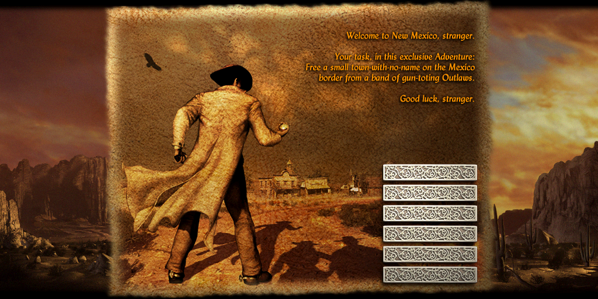

MAP
===

General
-------

Files with extension ``*.map`` contains background map during the menu stored in R5G6B5 bzip2 compressed image.

File List
---------

+----------------------------------------------------------------------+----------------------------------+
| Filename                                                             | md5sum                           |
+----------------------------------------------------------------------+----------------------------------+
| data/interface/maps/louisiana.map                                    | c32568e4871bc8875ada61ea02463552 |
+----------------------------------------------------------------------+----------------------------------+
| data/interface/maps/new mexico.map                                   | 1929980087102120b2fe391d85331193 |
+----------------------------------------------------------------------+----------------------------------+
| demo/data/interface/maps/demo_k.map                                  | b5b46505480cd34ec8a32aab35f68494 |
+----------------------------------------------------------------------+----------------------------------+
| localisation/russian/data/interface/maps/louisiana.map               | bcbc490d35ba57bcc186127ad1754158 |
+----------------------------------------------------------------------+----------------------------------+
| localisation/russian/data/interface/maps/new mexico.map              | d2561061ffcd1d218785e984cd67a375 |
+----------------------------------------------------------------------+----------------------------------+
| localisation_demo/french/data/interface/maps/notsure_demo_k.map      | 3d370ab0723e0ce55f1aa5b80d1e4a41 |
+----------------------------------------------------------------------+----------------------------------+
| localisation_demo/german/data/interface/maps/notsure_demo_k.map      | 6aade25ee42efa97e32884a7a2264f28 |
+----------------------------------------------------------------------+----------------------------------+
| localisation_demo/spanish/data/interface/maps/notsure_demo_k.map     | c407ea3903c03a30339bae53f9ffb37c |
+----------------------------------------------------------------------+----------------------------------+

Specifications
--------------

Structure
^^^^^^^^^

.. code-block:: text

    struct sbpicture

SBPICTURE
^^^^^^^^^

See :ref:`sbpicture`

Example
-------

The file from the `demo` version ``demo/data/interface/maps/demo_k.map`` is used as an example.

* Extract `sbpciture` to BMP format in the output direcetory ``/tmp/bmp_out/``:

.. code-block:: console

    $ mkdir /tmp/bmp_out
    $ odv_files_test -t map -e -o /tmp/bmp_out/ /tmp/demo_k.map
    [+] odv_dvf_open = /tmp/demo_k.map
    $

* Display all extracted informations to the standard output:

.. code-block:: console

    $ ./bin/odv_files_test -t map -i /tmp/demo_k.map
    [+] odv_map_open = /tmp/demo_k.map
    [- ODV MAP information -]
    [- ODV IMAGEMAP information -]
    image_count : 0x00000001
    [- ODV IMAGE information -]
    width : 0x0400 (1024)
    height: 0x0200 (512)
    type_compression: 0x00000002
    data_size: 0x00100000
    [-------------------------]
    [-------------------------]
    [---------------------------------]

Extracted BMP file:

    ``demo_k_map.bmp`` (converted to png)

